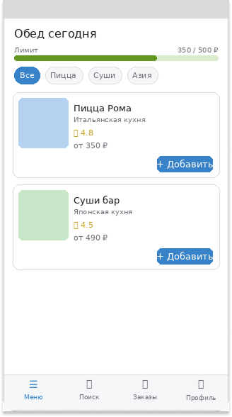
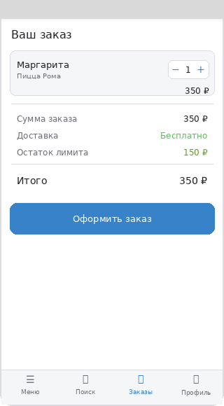

# 🍱 LunchLink - Агрегатор корпоративного питания

> **Бизнес-модель:** B2B2C  
> **Ниша:** Корпоративное питание 

---

## Elevator Pitch

Сотрудники офисов тратят до 40 минут в день на поиск и ожидание обеда, а кейтеринговые компании и рестораны не имеют стабильного потока корпоративных заказов. **LunchLink** — это B2B2C платформа, которая соединяет рестораны и кейтеринговые сервисы с работодателями, а работодатели через нас обеспечивают сотрудников удобным выбором обедов прямо в офис. В отличие от обычных агрегаторов доставки, мы работаем по корпоративной подписке: компания подключается, устанавливает лимит на питание, а сотрудник каждый день выбирает блюда из проверенных партнёров в одном приложении. В результате рестораны получают предсказуемый поток заказов без рекламы, работодатели — инструмент удержания сотрудников, а сами сотрудники — горячий обед без очередей и лишних затрат. 

---

## Lean Canvas

| Блок | Содержание |
|------|------------|
| **1. Сегменты потребителей** | **B2B:** HR-менеджеры и офис-менеджеры компаний от 50 сотрудников. **B2C (конечные пользователи):** офисные сотрудники. **Поставщики:** рестораны и кейтеринговые компании. **Ранние последователи:** IT-компании и стартапы с развитой корпоративной культурой |
| **2. Проблема** | 1. Сотрудники тратят много времени на поиск и ожидание обеда. 2. Рестораны не имеют стабильного корпоративного потока заказов. 3. Работодателям сложно организовать питание команды без лишней бюрократии. **Существующие альтернативы:** Яндекс Еда / Delivery Club (нет корпоративного контроля), собственная столовая (дорого) |
| **3. Уникальная ценность** | Единая платформа корпоративного питания: работодатель устанавливает лимит — сотрудник выбирает сам. Никаких чеков, никаких компенсаций вручную, повышение эффективности работы |
| **4. Решение** | 1. Мобильное приложение для сотрудников с ежедневным меню от партнёров. 2. Корпоративная панель управления для HR: лимиты, аналитика, бюджет. 3. Партнёрский кабинет для ресторанов: заказы, расписание, выплаты |
| **5. Каналы** | **Входящие:** SEO, HR-конференции, LinkedIn. **Исходящие:** Прямые продажи B2B, партнёрство с коворкингами и бизнес-центрами |
| **6. Потоки прибыли** | 1. Комиссия с каждого заказа (10–15%). 2. Подписка для компаний (тариф по числу сотрудников). 3. Премиум-размещение для ресторанов в каталоге |
| **7. Структура издержек** | Разработка и поддержка платформы, маркетинг и привлечение B2B-клиентов, команда (продажи, поддержка) |
| **8. Ключевые метрики** | Количество подключённых компаний, среднее число заказов на сотрудника в месяц, объём транзакций |
| **9. Скрытое преимущество** | Корпоративные данные о предпочтениях в питании — основа для персонализации и аналитики для ресторанов. Сетевой эффект: чем больше компаний, тем выгоднее ресторанам, и наоборот |

---

## Бизнес-модель

**Тип:** B2B2C  
**Домен:** FoodTech / HRTech  
**Платформы:** Mobile (iOS/Android) + Web (панель управления)

```
Рестораны → [LunchLink] → Работодатели → Сотрудники
  (B2B поставщик)           (B2B клиент)    (B2C пользователь)
```

---

---

## Roles
| Роль | Описание |
|------|----------|
| **Сотрудник** | Офисный работник, который хочет быстро и удобно заказать обед в рамках корпоративного лимита |
| **HR-менеджер** | Представитель компании, управляет подключением, бюджетами и лимитами на питание сотрудников |
| **Владелец ресторана** | Партнёр платформы, размещает меню, получает и подтверждает заказы, получает выплаты |
| **Поддержка** | Внутренняя команда LunchLink, решает споры и проблемы пользователей |
| **Админ** | Суперпользователь платформы, управляет партнёрами и модерирует контент |

---

## User Stories
### Сотрудник
| # | User Story |
|---|-----------|
| US-01 | Как сотрудник, я хочу видеть доступные рестораны и меню на сегодня, чтобы быстро выбрать обед |
| US-02 | Как сотрудник, я хочу оформить заказ в 2–3 клика, чтобы не тратить время в обеденный перерыв |
| US-03 | Как сотрудник, я хочу видеть остаток корпоративного лимита, чтобы понимать, сколько могу потратить |
| US-04 | Как сотрудник, я хочу отслеживать статус доставки, чтобы знать, когда придёт еда |
| US-05 | Как сотрудник, я хочу оставить оценку ресторану после заказа, чтобы помочь коллегам с выбором |
| US-06 | Как сотрудник, я хочу видеть историю своих заказов, чтобы повторить понравившийся |
| US-07 | Как сотрудник, я хочу авторизоваться через корпоративный email, чтобы не создавать отдельный аккаунт |

### HR-менеджер
| # | User Story |
|---|-----------|
| US-08 | Как HR-менеджер, я хочу подключить компанию к платформе, чтобы организовать питание команды |
| US-09 | Как HR-менеджер, я хочу устанавливать ежедневный лимит на сотрудника, чтобы контролировать бюджет |
| US-10 | Как HR-менеджер, я хочу видеть аналитику расходов по отделам, чтобы планировать HR-бюджет |
| US-11 | Как HR-менеджер, я хочу добавлять и удалять сотрудников, чтобы поддерживать актуальный список |
| US-12 | Как HR-менеджер, я хочу получать единый счёт раз в месяц, чтобы не проводить платёж за каждый заказ |

### Владелец ресторана
| # | User Story |
|---|-----------|
| US-13 | Как владелец ресторана, я хочу добавить своё заведение и меню на платформу, чтобы получать корпоративные заказы |
| US-14 | Как владелец ресторана, я хочу управлять составом и ценами меню, чтобы поддерживать актуальность предложения |
| US-15 | Как владелец ресторана, я хочу видеть входящие заказы и подтверждать их, чтобы управлять загрузкой кухни |
| US-16 | Как владелец ресторана, я хочу видеть статистику продаж, чтобы анализировать популярность блюд |

### Поддержка
| # | User Story |
|---|-----------|
| US-17 | Как сотрудник поддержки, я хочу видеть детали любого заказа, чтобы быстро решать споры |
| US-18 | Как сотрудник поддержки, я хочу отменять заказ от имени пользователя, чтобы решать проблемы без эскалации |

---

## Приоритизация по RICE
| # | User Story | R | I | C | E | Score |
|---|-----------|---|---|---|---|-------|
| US-01 | Просмотр меню ресторанов | 3 | 3 | 3 | 1 | **27** |
| US-02 | Оформление заказа | 3 | 3 | 3 | 1 | **27** |
| US-03 | Остаток лимита | 3 | 3 | 3 | 1 | **27** |
| US-07 | Авторизация через корп. email | 3 | 3 | 3 | 1 | **27** |
| US-04 | Отслеживание статуса доставки | 3 | 2 | 3 | 2 | **9** |
| US-06 | История заказов | 3 | 1 | 3 | 1 | **9** |
| US-08 | Подключение компании | 2 | 3 | 3 | 2 | **9** |
| US-09 | Установка лимита | 2 | 3 | 3 | 2 | **9** |
| US-13 | Добавление ресторана и меню | 2 | 3 | 3 | 2 | **9** |
| US-15 | Подтверждение заказов рестораном | 2 | 3 | 3 | 2 | **9** |
| US-05 | Оценка ресторана | 3 | 1 | 2 | 1 | **6** |
| US-11 | Управление списком сотрудников | 2 | 2 | 3 | 2 | **6** |
| US-14 | Управление меню | 2 | 2 | 3 | 2 | **6** |
| US-17 | Еженедельные выплаты | 2 | 3 | 2 | 2 | **6** |
| US-18 | Детали заказа для поддержки | 1 | 2 | 3 | 1 | **6** |
| US-10 | Аналитика расходов | 2 | 2 | 2 | 2 | **4** |
| US-12 | Ежемесячный счёт | 2 | 2 | 2 | 2 | **4** |
| US-19 | Отмена заказа поддержкой | 1 | 2 | 2 | 1 | **4** |
| US-16 | Статистика продаж ресторана | 1 | 2 | 2 | 2 | **2** |

---

## MVP и MLP
### MVP - критически важный функционал («скелет»)

| # | User Story | Обоснование |
|---|-----------|-------------|
| US-07 | Авторизация через корпоративный email | Без входа в систему ничего не работает |
| US-08 | Подключение компании HR-менеджером | Без компании нет ни лимитов, ни сотрудников |
| US-09 | Установка ежедневного лимита | Ключевая механика - без лимита нет контроля бюджета |
| US-13 | Добавление ресторана и меню | Без партнёров нечего показывать сотрудникам |
| US-01 | Просмотр меню на сегодня | Основной экран сотрудника |
| US-02 | Оформление заказа в 2–3 клика | Ключевое действие всего продукта |
| US-03 | Остаток корпоративного лимита | Без этого сотрудник не знает, что может заказать |
| US-15 | Подтверждение входящих заказов | Ресторан должен принять заказ, иначе хаос |
| US-04 | Отслеживание статуса доставки | Минимальная обратная связь после заказа |
| US-19 | Отмена заказа поддержкой | Нужен инструмент решения базовых проблем |

### MLP - фичи, дающие вау-эффект

| # | User Story | Что даёт пользователю |
|---|-----------|----------------------|
| US-05 | Оценка ресторана после заказа | Доверие к платформе, социальное доказательство |
| US-06 | История заказов + повтор | Экономия времени, удобство |
| US-10 | Аналитика расходов по отделам | HR видит ценность платформы в цифрах |
| US-11 | Управление списком сотрудников | Удобство для HR при изменениях в команде |
| US-12 | Ежемесячный сводный счёт | Снижает операционную нагрузку на бухгалтерию |
| US-14 | Гибкое управление меню | Ресторан может быстро реагировать на изменения |
| US-16 | Статистика популярности блюд | Помогает ресторану оптимизировать меню |
| US-17 | Еженедельные автовыплаты | Повышает лояльность ресторанов-партнёров |

---

## Функциональные и нефункциональные требования

> Выбраны **2 ключевые истории MVP** с наивысшим RICE-скором (27 баллов).

---

### US-02 - Оформление заказа

#### ФТ (Функциональные требования)

- Система отображает каталог блюд от доступных ресторанов на текущий день
- Система позволяет добавить блюдо в корзину одним нажатием
- Система показывает итоговую сумму заказа и остаток лимита в реальном времени
- Система блокирует оформление заказа, если сумма превышает установленный лимит
- Система запрашивает подтверждение перед финальным оформлением заказа
- Система отправляет push-уведомление сотруднику и уведомление ресторану после оформления
- Система присваивает заказу уникальный номер для отслеживания
- Система списывает сумму заказа с корпоративного счёта компании

#### НФТ (Нефункциональные требования)
> *Как система должна работать — скорость, надёжность, безопасность*

- Страница каталога загружается не более чем за 2 секунды
- Оформление заказа от открытия каталога до экрана подтверждения занимает не более 60 секунд
- Система обрабатывает одновременно не менее 1000 заказов без потери производительности
- Доступность сервиса (uptime) - не менее 99.9% в рабочие часы (10:00–15:00)
- Интерфейс оформления заказа корректно отображается на экранах iOS и Android 

---

### US-07 - Авторизация через корпоративный email

#### ФТ (Функциональные требования)

- Система принимает корпоративный email сотрудника как логин
- Система отправляет одноразовый код (OTP) на указанный email для подтверждения входа
- Система проверяет, что домен email совпадает с доменом зарегистрированной компании
- Система автоматически создаёт профиль сотрудника при первой успешной авторизации
- Система отображает понятное сообщение об ошибке, если домен не найден в базе компаний
- Система запоминает устройство и не запрашивает повторную авторизацию в течение 30 дней
- Система позволяет HR-менеджеру деактивировать доступ уволенного сотрудника

#### НФТ (Нефункциональные требования)

- OTP-код доставляется на email не более чем за 15 секунд
- OTP-код действителен не более 5 минут и аннулируется сразу после использования
- После 5 неудачных попыток ввода кода аккаунт блокируется на 15 минут
- Передача данных авторизации только по защищённому каналу (HTTPS / TLS 1.2+)

---

## DDD - Доменные зоны

### 1. Поиск и каталог


| Действие | Термин |
|----------|--------|
| Найти рестораны на сегодня по местоположению | `Location` |
| Фильтровать по кухне, рейтингу, цене | `Filter` |
| Просмотреть меню ресторана | `Menu` |

### 2. Заказ

| Действие | Термин |
|----------|--------|
| Добавить блюдо в корзину | `Cart` |
| Проверить остаток лимита | `Limit` |
| Оформить заказ | `Order` |
| Отслеживать статус доставки | `OrderStatus` |
| Отменить заказ | `Cancel` |
| Повторить прошлый заказ | `Reorder` |

### 3. HR и компания

| Действие | Термин |
|----------|--------|
| Подключить компанию к платформе | `Company` |
| Выбрать и оплатить тариф подписки | `Subscription` |
| Установить лимит на сотрудника | `Limit` |
| Добавить сотрудника | `AddEmployee` |
| Удалить сотрудника | `RemoveEmployee` |
| Получить ежемесячный счёт | `Invoice` |

### 4. Ресторан-партнёр

| Действие | Термин |
|----------|--------|
| Зарегистрировать ресторан | `AddRestaurant` |
| Обновить меню и цены | `MenuUpdate` |
| Подтвердить / отклонить заказ | `KitchenOrder` |
| Удалить ресторан | `RemoveRestaurant` |
| Получить выплату | `Payout` |
| Просмотреть статистику продаж | `SalesReport` |

### 5. Поддержка

| Действие | Термин |
|----------|--------|
| Ответить на обращение пользователя | `FAQ`  |
| Связаться с администратором | `Issue` |
| Отменить заказ от имени пользователя | `ForceCancel` |
| Инициировать возврат | `Refund` |

---

## BDD - Критический путь: оформление заказа (US-02)

### Пути с ошибками

**Заказ отсутствующего товара**
- Пользователь выбирает блюдо, которого нет в наличии
- Выходит из корзины (лимит потрачен)
- Ресторан не способен выполнить заказ
- Итог: у пользователя нет заказа, а лимит потрачен

**Заказ одного и того же блюда дважды**
- Пользователь дважды выбрал блюдо и подтвердил
- Итог: у пользователя 2 одинаковых блюда и потрачен лимит

### Критический путь фичи оформления заказа

Бронь успешная:
открыл приложение → увидел меню → добавил блюдо → нажал «Оформить» → заказ создан → ресторан получил заказ

---

#### Сценарий успеха

**Дано:**
- Сотрудник авторизован через корпоративный email
- И у компании активна подписка
- И остаток лимита сотрудника
- И ресторан «Пицца Рома» доступен сегодня

**Когда:**
- Он добавляет «Маргариту» (350 ₽) в корзину
- И нажимает кнопку «Оформить заказ»

**Тогда:**
- Сотруднику отправлен push с номером заказа
- Ресторан получил уведомление
- Остаток лимита обновился: 500 − 350 = 150 ₽
- Открылся экран отслеживания доставки

---

#### Сценарий отказа

**Дано:**
- Сотрудник авторизован через корпоративный email
- И у компании активна подписка
- И остаток лимита сотрудника - 200 ₽
- И ресторан «Пицца Рома» доступен сегодня

**Когда:**
- Он добавляет «Кальцоне» (350 ₽) в корзину
- И нажимает кнопку «Оформить заказ»

**Тогда:**
- Выводится сообщение: «Сумма превышает лимит. Доступно 200 ₽»
- Кнопка «Оформить» заблокирована
- Лимит не списывается
- Сотрудник остаётся в корзине

---

## Wireframes - Ключевые экраны

### Экран 1 - Меню (каталог)




---

### Экран 2 — Корзина




## API-First - JSON-контракты

### GET `/v1/menu`

Получить доступное меню ресторанов на указанную дату для компании.

**Query params:**
```
date=2026-05-02&company_id=42
```

**Response 200:**
```json
{
  "date": "2026-05-02",
  "employee_limit": {
    "total": 500,
    "spent": 0,
    "remaining": 500
  },
  "restaurants": [
    {
      "id": 7,
      "name": "Пицца Рома",
      "rating": 4.8,
      "delivery_time_min": 35,
      "menu_items": [
        {
          "id": 101,
          "name": "Маргарита",
          "price": 350,
          "available": true
        },
        {
          "id": 102,
          "name": "Кальцоне",
          "price": 490,
          "available": true
        }
      ]
    }
  ]
}
```

**Response 401** - сотрудник не авторизован  
**Response 403** - компания не подключена к платформе

---

### POST `/v1/orders`

Создать новый заказ.

**Request body:**
```json
{
  "restaurant_id": 7,
  "items": [
    {
      "menu_item_id": 101,
      "quantity": 1
    }
  ]
}
```

**Response 201:**
```json
{
  "order_id": "LL-20240502-0047",
  "status": "confirmed",
  "restaurant": "Пицца Рома",
  "total": 350,
  "limit_remaining": 150,
  "estimated_delivery": "12:45",
  "created_at": "2026-05-02T11:58:00Z"
}
```

**Response 400:**
```json
{
  "error": "limit_exceeded",
  "message": "Сумма заказа превышает остаток лимита",
  "limit_remaining": 200,
  "order_total": 350
}
```

**Response 409:**
```json
{
  "error": "item_unavailable",
  "message": "Блюдо недоступно для заказа",
  "item_id": 101
}
```